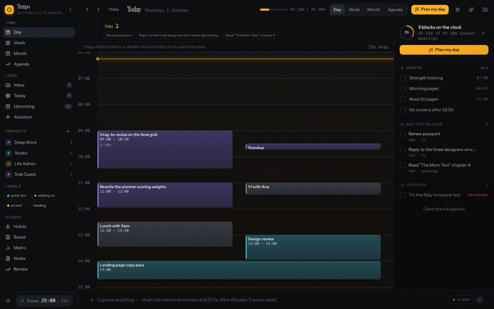
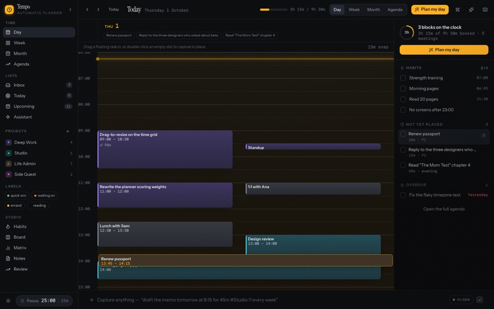

# Tempo

An automatic day planner. Tasks that schedule themselves, a calendar you can drag, and a coach that plans with you.

Tempo is a local-first task and calendar app where the **clock is the primary workspace**. Capture a task in plain language, let the planner find a slot for it, then drag that slot around when reality changes. No account, no server, no sync — everything lives in `localStorage`.



## Quick start

Requires Node 20.19+ or 22.12+.

```bash
npm install
npm run dev -- --port 5180 --strictPort
```

First load seeds a small sample workspace (projects, tasks, meetings, habits) so every view has something to show. Settings → **Reset to sample**, or the command palette, puts it back.

## Scripts

| Script | What it does |
| --- | --- |
| `npm run dev` | Vite dev server. Add `-- --port 5180 --strictPort` to match the smoke test. |
| `npm run build` | `tsc -b` then `vite build` into `dist/`. |
| `npm run preview` | Serve the production build. |
| `npm run lint` | oxlint. Zero errors and 40 warnings, mostly `react(purity)` for `new Date()` during render. |
| `node scripts/verify.mjs` | Headless visual smoke test: visits all 14 surfaces, screenshots them to `/tmp`, and fails loudly on console errors. |

`verify.mjs` reads `URL`, `OUT`, and `CHROME_PATH` from the environment. It defaults to `http://localhost:5180`, the `/tmp/tempo` prefix, and a Playwright-managed Chrome for Testing build.

## The one idea

Most task apps separate *what you want to do* from *when you will do it*, then leave you to reconcile the two by hand. Tempo keeps both on the same object:

- A task has a **`due`** date (a commitment) and an optional **`scheduled`** range (a promise about the clock).
- **Floating** tasks have a due date and no slot. They collect in the right rail and as dashed chips in the day header.
- **Scheduled** tasks have a slot. They are blocks on the grid.
- Dropping a floating task onto the grid gives it a time. Dragging a block moves it, and its `due` follows.
- The **planner** fills gaps: it respects working hours, existing meetings, buffer time, priority, estimated duration, energy type (`deep` / `shallow` / `admin`), preferred daypart, and habit anchors. It fills real openings rather than stacking things on top of each other.
- Anything you place by hand is marked `planLocked` and the planner will not move it again.

## Keeping the plan true

The calendar keeps its own promises. When the shape of a day changes — a meeting moves, a block is completed, working hours are edited — the blocks the planner owns are re-fitted around it, and one undo step covers the lot.

The rules it holds to:

- **Only blocks that stopped fitting move.** A block that still has a valid slot is left exactly where it is, so moving one meeting does not shuffle the rest of the day.
- **Anything you placed by hand never moves.** Dragged, resized or dropped blocks are `planLocked` and are treated as immovable walls. If you put a block under a meeting, it stays there — that was your call.
- **It never schedules new work.** A refit re-fits what is already on the clock and nothing else. Filling a day with new work is a decision you make from the planner sheet, not a side effect of moving a meeting.
- **It works in a window.** A change on Thursday refits the visible seven days; work scheduled beyond that is untouched.
- **If a block cannot fit anywhere in the window, it comes off the clock** and says so, rather than silently sitting on top of a meeting.

Settings → **Keep the plan true** turns the whole mechanism off, leaving the planner sheet as the only way to place work.

## Scheduling by hand

| Gesture | Result |
| --- | --- |
| Drag a block | Moves it in time; in week view it moves across days and the due date follows |
| Drag a block's top or bottom edge | Resizes, snapped to your step, never across days |
| Drag a floating chip or rail row onto the grid | Schedules it at the drop time, with a live ghost showing the exact range |
| Drag an all-day event onto the grid | Turns it into a timed block |
| Click an empty slot | Opens a title field there, defaulting to 30 minutes |
| Drag out a range | Opens the same field on the range you drew, with its length |

That field reads `#project`, `@label`, `!1`–`!4`, energy and recurrence as you type, with
the same chips the capture bar shows. The range you drew stays the clock — a time in the
text never silently moves the block.
| Arrow keys on a focused block | Nudge by one step; `Shift` + arrows change length |
| Right-click a block | Move off the calendar, start a focus block, duplicate, delete |



## Everything else

- **Saved filters** — a named question about your tasks, kept so you can ask it again.
  Conditions on project, label, priority, due window, whether it is on the clock, and
  energy, combined with *and*. Filters live in the sidebar with a live count, take the
  number keys after the fixed views, and travel with your export.
- **Quick capture** parses `#project`, `@label`, `!1`–`!4`, `tomorrow`, `at 9:30`, `for 45m`, `every tue`, and shows a live reading of what it understood. Typed times may be 12- or 24-hour; everything Tempo *shows* is 24-hour, including the time fields — there is no native time input left in the app.
- **Views**: day, week, month, agenda (7/14/21 days), inbox/today/upcoming lists, saved
  filters, focus, Eisenhower matrix, project board, habits, notes, review.
- **Folders** group projects one level deep in the sidebar. Right-click a project to file it
  somewhere else, and a saved filter can ask for "everything in Work".
- **Repeating meetings** — set a repeat rule in the event panel and the occurrences are
  issued as real entries on the calendar. Moving or cancelling one leaves the rest alone;
  changing the time or deleting asks whether you meant this one, this and future, or the
  whole series.
- **Habits** with daily/weekdays/weekly/custom cadence, anchors, streaks, and honest counts.
- **Steps** are time-aware: a task with three steps asks the clock for a third of its
  estimate while two are outstanding, and ticking one shortens its block on the spot.
- **Focus timer** with rounds and long breaks, opened from the sidebar pill as a modal, or full-screen with `F`. Focus mode shows one ring, the task, and what comes next; `Space` runs the session and `Esc` leaves with the session still running. Timer state lives outside React, so no surface can interrupt a run. Finished focus blocks are logged as store records; break sessions never pollute the numbers.
- **Coach** works offline against a deterministic intent engine (add, schedule, unschedule,
  complete, delete, priority, plan). Ask it to "free up an hour at 14:00" and it proposes
  ways to make room — move this block, drop that one, shorten the other — instead of
  silently rearranging your afternoon; you pick, and one undo covers it. Supply an
  Anthropic or OpenAI key in Settings for model-written replies.
- **Phase chime** (Settings → Focus, off by default). A short two-note tone when a
  block or a break ends — low when a break starts, brighter when work resumes. Silent
  while the window is in the background, and it never overrides your system volume.
- **Focus** (`5` in the sidebar) puts the honest session record next to a daily goal:
  a progress ring, a streak that counts days you *finished* at the goal, and seven days
  of bars with the goal drawn across them. The numbers come from the same accounting as
  Review — a finished session counts at its planned length, a running one at elapsed time,
  an abandoned one at nothing.
- **"Now"** — the top bar names the one to three blocks worth doing at this moment,
  scored by deadline pressure, priority, whether this kind of work suits the hour, and
  whether you placed the block yourself. It only advises: it never moves anything, and
  clicking a name opens the task.
- **Planner** fills real openings — working hours, meetings, buffers, priority, estimated duration, `deep`/`shallow`/`admin` energy, preferred daypart and habit anchors — never stacking work on top of anything.
- **Review** reports where time actually went, counting completed sessions at their planned length and abandoned ones at zero.
- **Overlapping blocks cascade** instead of splitting the column into narrow lanes. Each colliding block is a full-width band that steps down and right a little further and paints over the one above, so three meetings at 09:30 all stay readable with their titles intact. The step is capped by the shortest block, and thin bands tighten their padding and drop the time line rather than clipping text.
- **Undo/redo** across 60 steps, including planner applications and drops.
- Markdown rendering builds React elements only — no HTML strings, links limited to `http`/`https`/`mailto`.

## Keyboard

Press `?` for this list in the app.

| Keys | Action |
| --- | --- |
| `C` | Jump to the capture bar |
| `Enter` / `Shift Enter` | Create the task / add a line |
| `T` `D` `W` `M` `A` | Today, day, week, month, agenda |
| `P` | Open the planner |
| `1`–`8` | Jump to a view by number |
| `9` | First saved filter, or Habits when you have none |
| `G` then `I` / `T` / `U` / `D` / `W` | Inbox, today, upcoming, day, week |
| `Cmd K` | Command palette |
| `F` | Enter or leave focus mode |
| `Space` | Start or pause the timer, in focus mode |
| `/` | Search |
| `Cmd Z` / `Shift Cmd Z` | Undo / redo |
| `S` | Toggle light and dark |
| `Esc` | Close whatever is open |

## Data and privacy

Everything is in `localStorage` under `tempo.v1` — tasks, events, habits, docs, projects, labels, focus sessions, chat, settings. There is no network call unless you explicitly enable and configure an LLM, in which case requests go straight from your browser to Anthropic or OpenAI and the key is stored only in that same `localStorage`. Nothing is sent anywhere else.

`localStorage.removeItem('tempo.v1')` resets to the sample workspace on next load.

## Architecture

```
src/
  types.ts              Entities, settings, view model
  lib/
    store.ts            Zustand store, undo history, persistence, seed
    planner.ts          Interval algebra: free/busy, first-fit placement
    nlp.ts              Capture-bar parser
    assistant.ts        Offline intents + optional LLM calls
    selectors.ts        Calendar projection and overlap packing
    drag.ts             Cross-component drag payload
    seed.ts             Sample workspace and default settings
    date.ts             Day keys, formatting, snapping
  components/
    calendar/           TimeGrid (drag/resize/create) and CalendarView
    views/              Month, agenda, matrix, board, habits, notes, review, lists
    ui.tsx              Buttons, inputs, modals, popovers, rings
```

State is a single Zustand store keyed by ID, so any view can render any entity. The calendar projection is deliberately separate from storage: `toItems()` flattens tasks and events into one list, and `layoutItems()` packs overlaps into lanes.

## Stack

React 19, TypeScript 6 (strict, `noUnusedLocals`), Vite 8, Tailwind CSS v4 via `@tailwindcss/vite`, Zustand 5, date-fns 4, lucide-react, clsx, oxlint, Playwright for the smoke test.

## Known limitations

- Chromium throttles `dragover` to roughly 350 ms, so a drop preview can lag the cursor by one snap step. The landing position is recomputed from the real `drop` event, so what you release onto is always correct.
- Recurring tasks generate the next occurrence when you complete one; editing or moving a recurring task edits that single occurrence. Recurring *events* are not supported at all — `recurrence` is on `Task` only, so a standup cannot repeat.
- There are no unit tests yet. `scripts/verify.mjs` covers rendering and console cleanliness across every view.
- A `planLocked` block can end up underneath a meeting, because you are allowed to put it there and Tempo will not argue.
- Subtasks exist in the model but the planner ignores them, so a three-subtask task is planned as one block.
- The notes markdown renderer covers headings, lists, checklists, quotes, code, links, and emphasis — no tables or fenced code blocks.